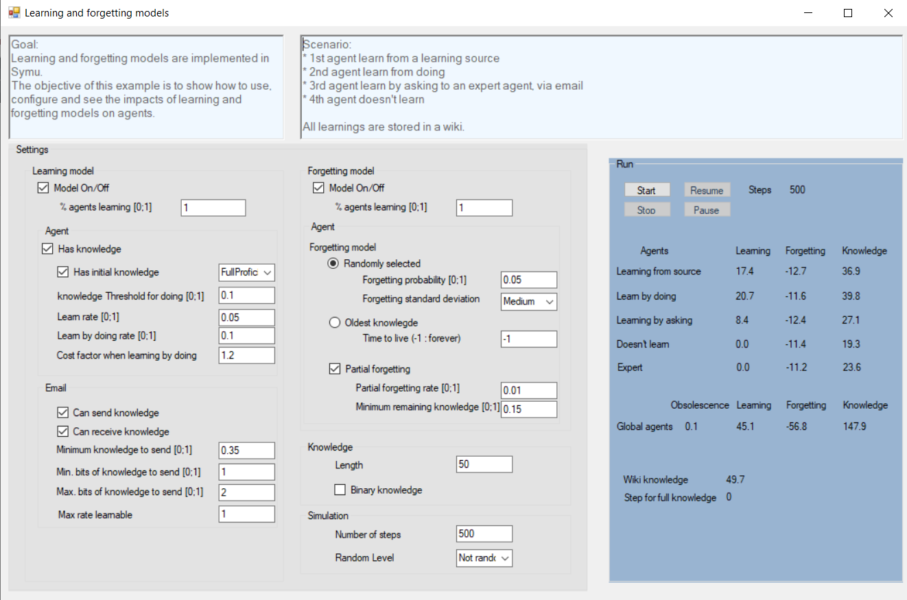

**************************
SymuLearnAndForget example
**************************

Different models are implemented in this simulator. This example demonstrates the use of three of them: index:: knowledge, index:: learning and index:: forgetting.

Knowledge model
***************

Agents can start the simulation with initial knowledge or information.

Learning model
**************

Agents have the capacity to learn new knowledge or information during the simulation.
There are different means to learn new knowledge: 

* learning from a source of information
* by interacting with another agent
* by doing by itself

.. toctree::
   :maxdepth: 2
   :caption: Find more information about the learning model:
   
   ../models/cognitivearchitecture/tasksandperformance

Forgetting model
****************

The counterpart of learning is forgetting. Agents may forget knowledge or information if they are not solicited during the simulation. Using a bit of knowledge during a step is enough to be sure that this bit will not be forget today.
Forgetting has different modes: 

* it could be random 
* based on the age of the information

.. toctree::
   :maxdepth: 2
   :caption: Find more information about the forgetting model:
   
   ../models/cognitivearchitecture/internalcharacteristics

Scenario
********

You can use this example to discover and understand the impact of all the setups on the agents. That will help you setup you own learning and forgetting models.

#. The first agent learns from a learning source
#. The second agent learns from doing
#. The third one learns by asking to an expert agent
#. The last agent doesn’t learn
#. All learnings are stored in a wiki.

Find the `source code <https://github.com/lmorisse/Symu/tree/master/Symu%20examples/SymuLearnAndForget>`_
