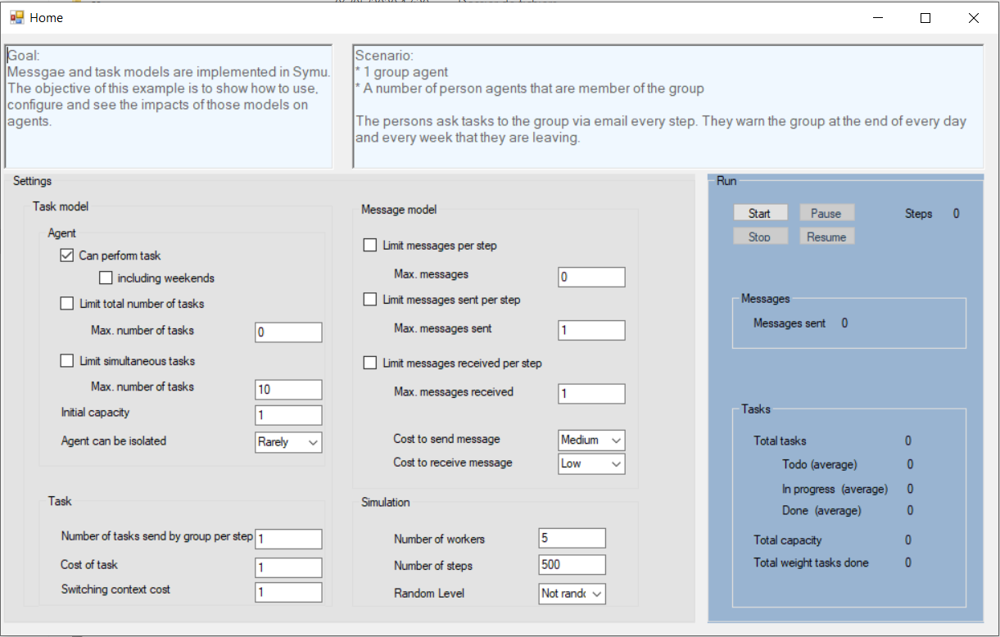

**************************
SymuMessageAndTask example
**************************

Different models are implemented in this simulator. This example demonstrates the use of two of them: index:: messaging and index:: tasking.
We have treated those two models at the same time because both are the engines of the simulation.

Messaging model
***************

Messaging is the only way agents communicate to each other. So messaging model represents the interaction mechanism of agents. This is one of the means of ensuring the autonomy of agents. A message can have different types: it can be a phone call, a meeting, an email, …

.. toctree::
   :maxdepth: 2
   :caption: Find more information about the messaging model:
   
   ../models/cognitivearchitecture/messagecontent

Tasking model
*************

In Symu, agents are task-based. A task is an action with a cost. Some of them don’t perform task, such as a book or a static website; others can perform task such as workers. You can specify if the agent can perform task on weekends or not, that can be useful when your organization is an enterprise.

.. toctree::
   :maxdepth: 2
   :caption: Find more information about the tasking model:
   
   ../models/cognitivearchitecture/tasksandperformance

Scenario
********

You can use this example to discover and understand the impact of all the setups on the agents. That will help you setup you own messaging and tasking models.

#. 1 group agent
#. A number of person agents who are members of the group

The persons ask tasks to the group via email every step. They warn the group at the end of every day and every week that they are leaving.

Find the `source code. <https://github.com/lmorisse/Symu/tree/master/Symu%20examples/SymuMessageAndTask>`_
