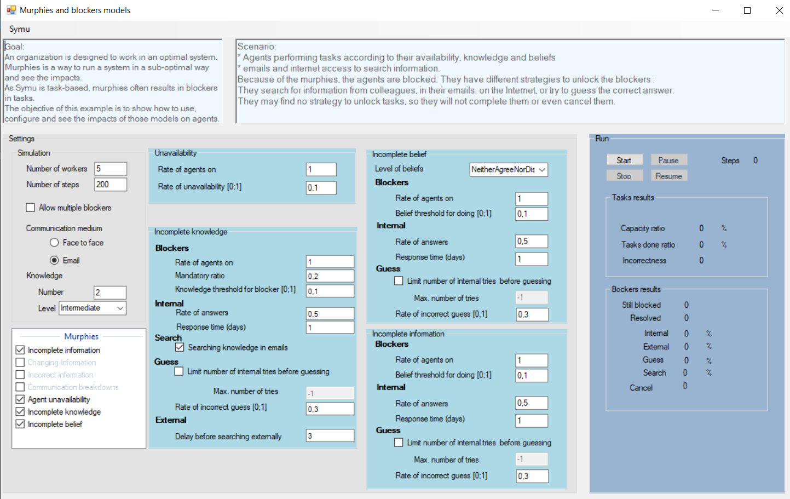

*******************************
SymuMurphiesAndBlockers example
*******************************

An organization is designed to work in an optimal system. :index:`Murphy` is a way to run a system in a sub-optimal way and see the impacts.
As Symu is task-based, murphies often results in blockers in tasks.
The objective of this example is to show how to use, configure and see the impacts of those models on agents.

Murphies models
***************

By construction, Symu offers you several possible scenarios for working sub-optimally:

* Unavailability
* Incomplete knowledge
* Incomplete beliefs
* Incomplete information

.. seealso:: :doc:`../models/murphies`

Scenario
********
#. Agents performing tasks according to their availability, knowledge and beliefs
#. Emails and internet access to search information.

Because of the murphies, the agents are blocked. They have different strategies to unlock the blockers :
They search for information from colleagues, in their emails, on the Internet, or try to guess the correct answer.
They may find no strategy to unlock tasks, so they will not complete them or even cancel them.

You can use this example to discover and understand the impact of all the setups on the agents. That will help you setup you own murphies models.

Find the `source code. <https://github.com/lmorisse/Symu/tree/master/Symu%20examples/SymuMurphiesAndBlockers>`_
