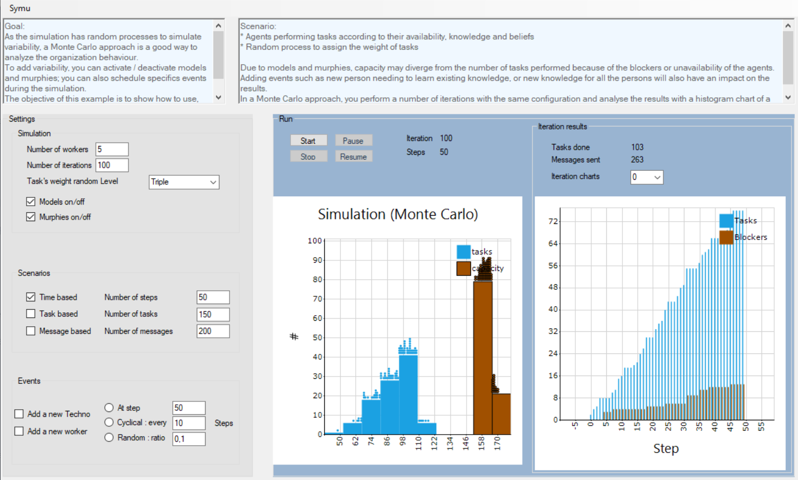

.. index:: scenario, event

*******************************
SymuScenariosAndEvents example
*******************************

You can use this example to discover and understand how to use scenarios and events models to run a simulation.
As the simulation has random processes to simulate variability, a Monte Carlo approach is a good way to analyze the organization behaviour.
To add variability, you can activate / deactivate models and murphies; you can also schedule events during the simulation.
The objective of this example is to show how to use, configure and see the impacts of this approach on results.

Scenarios
*********
To run a simulation, you must at least define one scenario. it will basically allow to define which parameter allows to stop the simulation and for which value.
There are thress pre-defined scenarios :
* Time based
* Tasks based
* Messages based
You can define your own scenario. A simulation may be define with multiple scenarios.

Events
******
To add variability, you can schedule events during the simulation. You will find by design one shot, cyclical and random events.
You can only use scenarios if you choose. But the scenarios and the events are different by design. The scenario is an agent, has its own life cycle, interacts with other agents via asynchronous messages; where events is a simple class that can be used directly by the agent via an EventHandler.

At least one scenario is required to run a simulation, then you choose what best suits your needs for variability between scenarios and events.

.. seealso:: :doc:`../models/simulation`

Scenario
********

* Agents performing tasks according to their availability, knowledge and beliefs
* Random process to assign the weight of tasks

Due to models and murphies, capacity may diverge from the number of tasks performed because of the blockers or unavailability of the agents.
Adding events such as new person needing to learn existing knowledge, or new knowledge for all the persons will also have an impact on the results.
In a Monte Carlo approach, you perform a number of iterations with the same configuration and analyse the results with a histogram chart of a frequency distribution in which the height of the bars are proportional to the result frequencies.

Find the `source code <https://github.com/lmorisse/Symu/tree/master/Symu%20examples/SymuScenariosAndEvents>`_