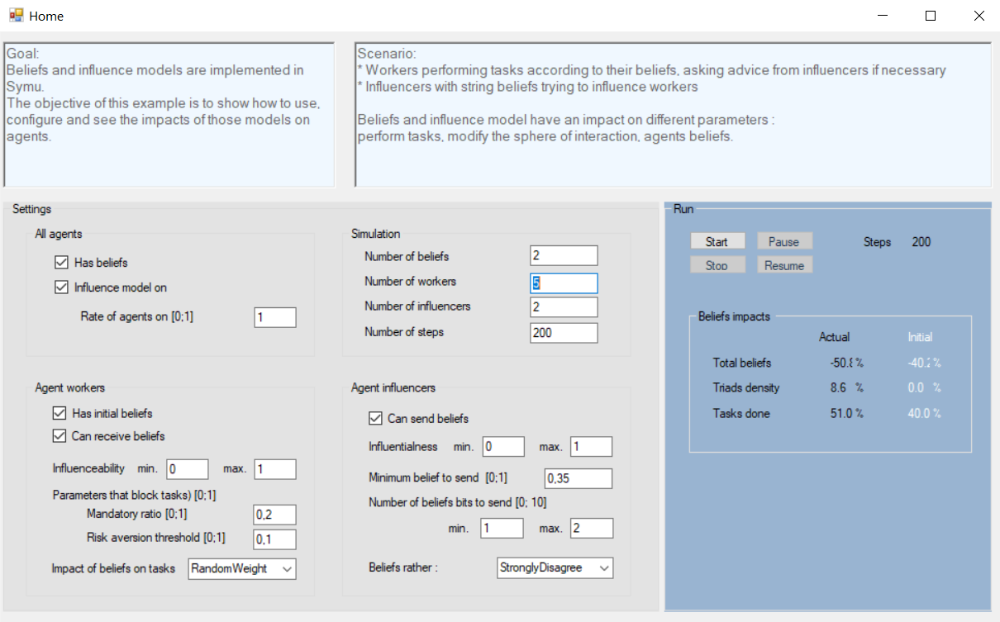

.. index:: Beliefs, influence

*******************************
SymuBeliefsAndInfluence example
*******************************

Different models are implemented in this simulator. SymuBeliefsAndInfluence demonstrate the use of two of them: the beliefs and the influence model.

You can use this example to discover and understand the impact of all the setups on the agents. That will help you setup you own interaction model.

Beliefs model
*************

Symu is a multi-agent system for the co-evolution of agents and socio-cultural environments with an interaction model between agents.
These interactions are based on the information exchanged but also the beliefs. 

.. seealso:: :doc:`../models/cognitivearchitecture/Knowledgeandbeliefs`

Influence model
***************
This model define how an agent will reinforce its belief or change its belief from influencer.
.. seealso:: :doc:`../models/agent`

Scenario
********

* Groups of people
* People who are members of the group

Knowledge, activites, beliefs and social-demographics are defined for every agents. Those parameters has an impact on the way people are interacting every day in their group, in their sphere of interaction.
Play with the interaction strategy to see the impact on the organization flexibility, defined by the capacity of creating triads.
Try to increase triads with the creation of new interactions.

Find the `source code <https://github.com/lmorisse/Symu/tree/master/Symu%20examples/SymuBeliefsAndInfluence>`_